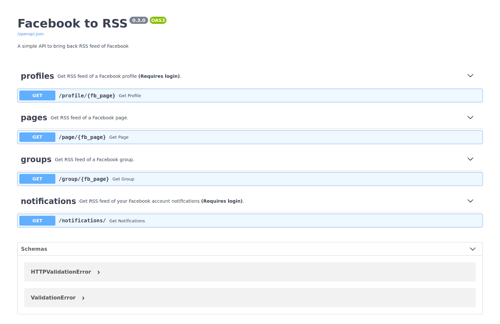

# Facebook to RSS API [WIP]

A small API for accessing Facebook profile, pages, groups posts and notifications as RSS feeds. Based
on [FastAPI](https://github.com/tiangolo/fastapi) and [Playwright](https://github.com/microsoft/playwright-python).

## Disclaimer

1- This tool is provided with no warranty of any kind. I am not responsible for anything that might happen to your
Facebook account that will be automated by this tool.

2- This tool is still experimental. It has not been tested heavily and still has some features that are not implemented
yet. I built it for personal use but decided to release it as a public open source project. If you have any questions or
suggestions feel free to open an issue. Contributions are welcome too!

## Installation

The tool requires Python 3.7 with pip v19+ installed or poetry if you use it.

Clone the repository and run any of the following commands:

**Using poetry**

```bash
poetry install
```

**Using Pip**

```bash
pip install .
```

Finally install Playwright required files

```bash
playwright install
```

## Usage

- First, If you want to access profiles and private groups feeds, login to Facebook using the following command that
  will save your session in order to be used later:

```bash
python3 -m facebook_rss --login -u email -p password
```

- Next, run the following command to start serving the API:

```bash
uvicorn facebook_rss.main:api
```

- You can pass any [uvicorn](http://www.uvicorn.org/#command-line-options) cli options like host and port. Also, you can
  use your own configuration dot env (
  copy [config_example.env](https://github.com/yshalsager/facebook2rss/blob/master/config_example.env) and change the
  available options) file by passing it to uvicorn using `--env-file`

```bash
uvicorn facebook_rss.main:api --env-file config_example.env
```

### Getting Facebook Feeds as RSS

- All you need to do is to access the respective Facebook feed API route as detailed in the available API documentation
  thanks to FastAPI.

- For example if the API is running on localhost and port 8080 you can access the documentation
  in `http://127.0.0.1:8080/docs`.

- In a nutshell, here are the available routes:
  

## Features

- Access Facebook pages and public groups feed without using an account.
- Access Facebook profiles, pages, groups and notifications when running the API with a Facebook account.
- Your login is automatically saved and refresh on each API request to keep you signed in.
- Facebook posts can be fetched as HTML (default) or text.
- Append Facebook comments of any post RSS feed. (Disabled by default)
- Easily configure the API as you want either using custom config.env file or by overriding a certain option using
  uvicorn.
- RSS feeds are cached by default (for 30 minutes) to not abuse Facebook and trigger any anti-automation mechanisms.
  This can be configured as you want and also can be ignored by using `no_cache=1` parameter with any of the API routes.
- Supports using HTTP or SOCKS5 proxies.

## Limitations

- Two-factor authentication is not supported

## Current status

- Data is being scraped from mbasic Facebook website that doesn't use Javascript and cached for 30 minutes.
